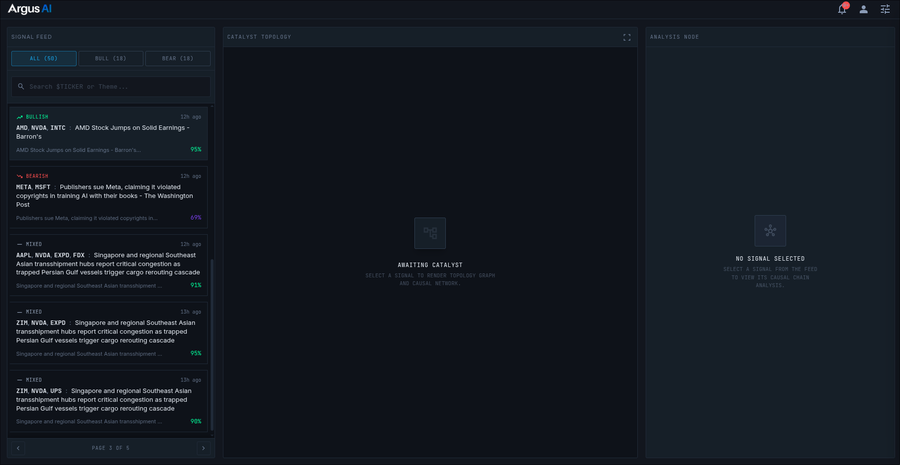
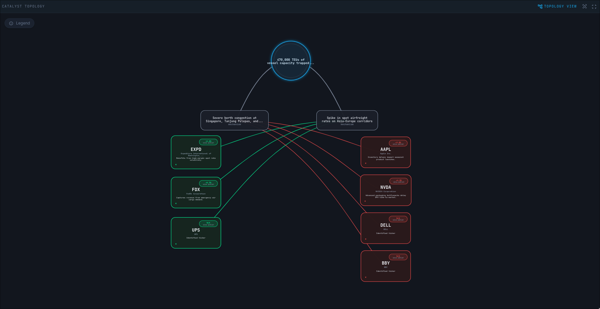

# Argus AI

Argus AI is a market-catalyst intelligence system that turns noisy finance headlines into structured, tradable narratives.

It watches the news stream, extracts the companies and themes that matter, scores the signal, and presents the result in a polished analyst dashboard and Telegram workflow. The goal is not to flood you with headlines. The goal is to explain why a story matters, which names it touches, and how the catalyst can propagate through the market.

## What It Does

Argus AI is built around a simple pipeline:

1. **Ingest** market-moving news from NewsAPI.
2. **Filter** for stories that are likely to matter to public markets.
3. **Analyze** the article with Gemini to extract direction, confidence, root cause, and follow-on effects.
4. **Deduplicate** and queue events through Redis so the same story is not processed twice.
5. **Persist** curated signals in PostgreSQL for history, review, and performance tracking.
6. **Visualize** the causal chain in a dark, radar-style dashboard with signal feed, topology graph, and analysis panel.
7. **Deliver** alerts and commands through Telegram for fast operator access.

## Why It Exists

Most market news apps stop at the headline. Argus AI goes one step further and answers the questions traders actually ask:

- What is the root cause?
- Which tickers are directly affected?
- Is the catalyst bullish, bearish, or mixed?
- How confident is the system?
- What is the second-order impact?

That makes the product useful as a hackathon demo because it shows both the AI decisioning layer and the user-facing interpretation layer in one place.

## Product Surfaces

The demo is centered on a few clear experiences:

- **Signal Feed** - a live list of market-relevant catalysts with direction and confidence.
- **Catalyst Topology** - a graph that maps root cause to affected names, themes, and downstream effects.
- **Analysis Node** - a focused summary card that explains the selected signal in plain language.
- **Telegram Commands** - subscription, linking, broadcast control, and latest-signal lookup.
- **Performance Tracking** - a database-backed foundation for evaluating whether a signal was directionally correct over time.

## How It Works

The system is split into a few cooperating services:

- **Node.js runtime** handles the API surface, Telegram webhook, and news polling.
- **Python worker** performs the deeper signal analysis and enrichment pass.
- **Redis** acts as the short-lived queue and dedupe layer.
- **PostgreSQL** stores users, signals, and performance records.
- **Google Gemini** provides the language-model reasoning used to turn articles into structured trading narratives.
- **D3.js** powers the graph-style visualization in the dashboard.

## Technology Stack

| Layer | Technologies |
|---|---|
| Frontend | Vanilla JavaScript, HTML, Tailwind CSS, D3.js |
| Backend | Node.js, Telegraf, native HTTP server |
| Analysis | Python, Google Gemini, heuristic enrichment |
| Data | PostgreSQL, Redis |
| Ingestion | NewsAPI |
| Delivery | Telegram bots, webhook flow |
| Deployment | Docker Compose, Vercel config, ngrok for local webhook tunneling |

## Architecture Snapshot

- `src/newsApi.js` pulls finance headlines and uses Redis-backed pending/seen keys to keep the feed clean.
- `python/worker.py` enriches signals with tickers, causal chains, market impact, and confidence calibration.
- `src/index.js` exposes health, API, and Telegram routes while keeping the app online as a small control plane.
- `website/app.js` renders the dashboard, signal feed, and interactive topology view.

## What Makes It Stand Out

- Converts headlines into a causal story instead of a generic sentiment score.
- Shows a visual market graph rather than a plain table.
- Combines AI analysis with real delivery channels like Telegram.
- Feels like an analyst workstation, which makes it well suited for a hackathon demo screen.

## Live Product Views

These screenshots are from the actual app experience and show how Argus AI moves from signal discovery to causal explanation.

### Full Workspace Overview

This is the main operating view. The left rail surfaces ranked market signals, the middle panel visualizes the causal topology, and the right rail explains the selected event in plain language with confidence, horizon, and contagion path. The layout is meant to feel like an analyst workstation rather than a generic feed.

### Catalyst Topology Deep-Dive

This zoomed graph is the heart of the product. It turns one catalyst into a branching market map: root cause at the center, direct exposures around it, and downstream winners and losers connected by color-coded relationship lines. This is the view that makes the hidden supply-chain and cross-asset links easy to understand at a glance.

### Alternate Causal Chain View

This example shows a different market setup: a logistics-driven disruption that ripples into downstream customer exposure, airfreight substitution, and inventory effects. Including a second graph makes the README more complete because it demonstrates that Argus AI is not limited to one narrative style. It can trace both direct and second-order market reactions across different catalyst types.

The point of these visuals is not just aesthetics. They show the product’s core promise: take one headline, trace the ripple effect, and surface the names that matter before the rest of the market catches up.

## Built For The Demo

This repository is designed to showcase the core product idea first and the implementation second. If you are presenting it at a hackathon, the strongest narrative is:

> **Argus AI** is an AI market-intelligence layer that turns breaking news into structured, explainable trading signals. It finds the hidden market actors and supply chain risks that most traders miss.
